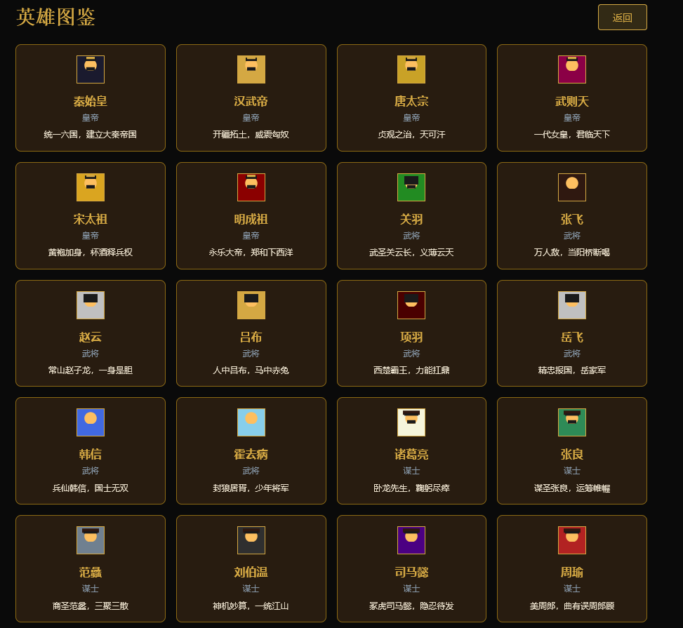
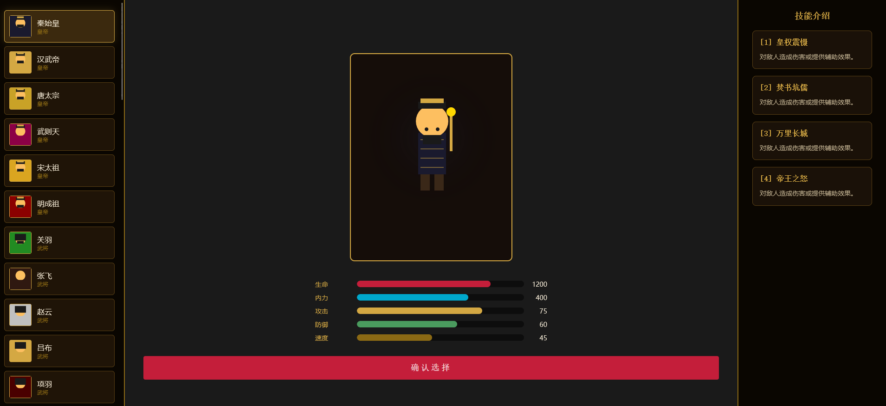
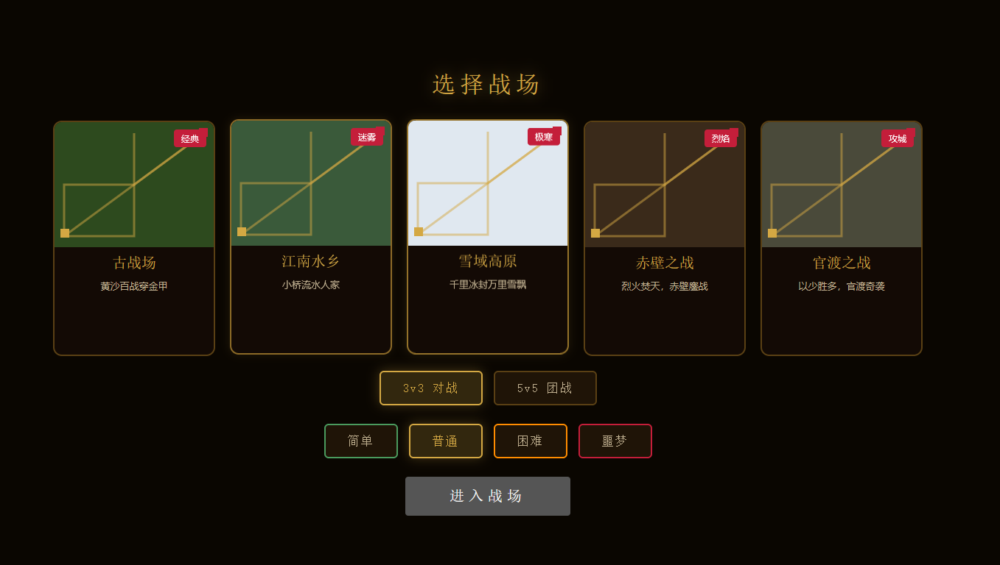
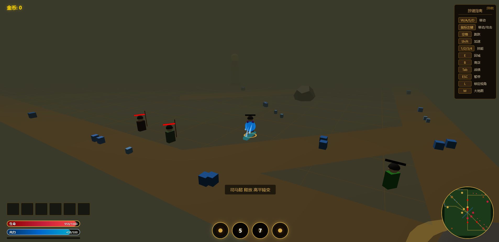
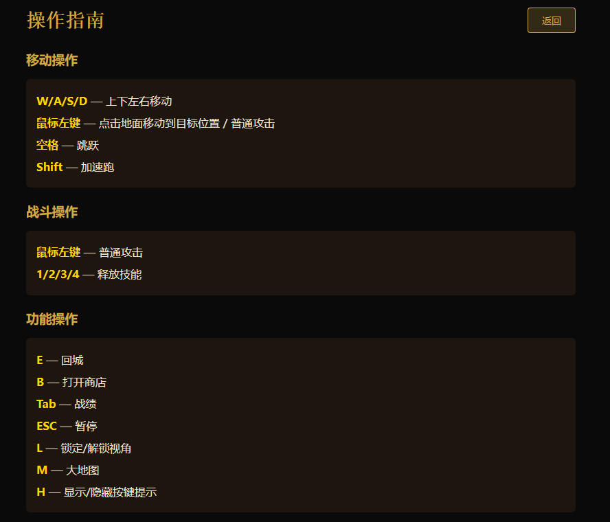

## 🌐 在线试玩

**国内快速访问地址：**
- [https://chinahero.netlify.app](https://chinahero.netlify.app)

> 如果链接失效，可以通过以下方式部署：
> 1. 点击 [Deploy to Netlify](https://app.netlify.com/start/deploy?repository=https://github.com/Jsoned/huaxia-yingjie)
> 2. 用GitHub账号登录
> 3. 自动部署，获得自己的访问地址

---

<div align="center">

# 🎮 华夏英杰传 / Huaxia Yingjie

### 3D MOBA 网页游戏 / 3D MOBA Web Game

<p>
  
  
  
  
  
</p>

<p>
  <a href="https://github.com/Jsoned/huaxia-yingjie" target="_blank"><b>📦 GitHub仓库</b></a>
</p>

</div>

---

## 📸 游戏截图 / Screenshots

<div align="center">

### 英雄图鉴 / Heroes Gallery


### 英雄详情 / Hero Detail


### 战场选择 / Map Selection


### 游戏画面 / Gameplay


### 操作指南 / Controls


</div>

---

## 🚀 在线试玩 / Play Online

> ⚠️ **提示**：由于GitHub Pages在国内访问不稳定，推荐以下方式运行游戏

### 方式1：本地下载运行（推荐 / Recommended）

```bash
# 1. 下载本仓库所有文件
# 2. 双击打开 index.html 即可游玩
# 或启动本地服务器：
python -m http.server 8080
# 访问 http://localhost:8080
```

### 方式2：在线预览（需科学上网 / Need VPN）
- 🔗 GitHub Pages: https://jsoned.github.io/huaxia-yingjie/

### 方式3：复制到国内平台
- 将 `index.html` 和 `game.js` 上传到 **Gitee**、**Coding** 或 **阿里云OSS** 即可获得国内高速访问

---

## 📖 游戏介绍 / Game Introduction

**中文**：《华夏英杰传》是一款基于 **Three.js** 开发的 **3D MOBA 网页游戏**。玩家可以操控中国历史名将，在经典三路战场上与敌方英雄对战，摧毁敌方水晶获得胜利。

**English**: **Huaxia Yingjie** is a **3D MOBA web game** built with **Three.js**. Players control legendary Chinese historical heroes, battling enemy heroes on a classic three-lane battlefield to destroy the enemy crystal and win.

### ✨ 核心特色 / Core Features

| 特色 / Feature | 描述 / Description |
|---------------|-------------------|
| 🏛️ **50位历史英雄** / 50 Heroes | 秦始皇、关羽、诸葛亮、李白、花木兰等 |
| ⚔️ **8种英雄职业** / 8 Classes | 皇帝、武将、谋士、美人、刺客、名医、工匠、诗人 |
| 🗺️ **三路MOBA战场** / Three Lanes | 上路、中路、下路，防御塔、水晶、兵线系统 |
| 🛡️ **装备商店系统** / Item Shop | 基地购买装备，属性叠加，策略搭配 |
| 🤖 **4级难度AI** / 4 Difficulties | 简单/普通/困难/噩梦，AI智能逐级提升 |
| 👥 **3v3 / 5v5 模式** / 3v3 / 5v5 Modes | 灵活选择对战规模 |
| ✨ **独特技能特效** / Unique Skills | 每位英雄4个技能，各有独特Three.js动画效果 |
| 🧠 **智能AI系统** / Smart AI | 友方和敌方AI会巡逻、攻击、回城、购买装备 |

---

## 🎮 操作指南 / Controls

| 按键 / Key | 功能 / Function |
|-----------|----------------|
| `W/A/S/D` | 移动 / Move |
| `鼠标左键` / `Left Click` | 普攻 / Attack |
| `1/2/3/4` | 技能 / Skills |
| `Shift` | 加速 / Sprint |
| `E` | 回城 / Recall |
| `B` | 商店 / Shop |
| `L` | 视角 / Camera |
| `Tab` | 战绩 / Scoreboard |
| `M` | 地图 / Map |
| `H` | 帮助 / Help |
| `ESC` | 暂停 / Pause |

---

## 📚 玩法介绍 / How to Play

### 🎯 游戏目标 / Objective

**中文**：摧毁敌方水晶，同时保护己方水晶！控制你的英雄在三路战场上推进，击杀敌人，摧毁防御塔，最终取得胜利。

**English**: Destroy the enemy crystal while protecting your own! Control your hero on the three-lane battlefield, kill enemies, destroy towers, and achieve victory.

### 🎲 核心玩法 / Core Gameplay

1. **选择英雄 / Choose Hero** - 50位历史英雄，8种职业
2. **三路推进 / Three Lanes** - 上路、中路、下路，选择你的路线
3. **击杀小兵 / Kill Minions** - 每30秒一波小兵，击杀获得金币
4. **购买装备 / Buy Items** - 按B打开商店，用金币提升属性
5. **摧毁防御塔 / Destroy Towers** - 推倒敌方防御塔推进战线
6. **团队协作 / Teamwork** - 友方AI会配合你作战
7. **回城恢复 / Recall** - 血量低时按E回城恢复

### 🏆 获胜技巧 / Winning Tips

- **合理选路 / Choose Wisely**: 根据英雄特点选择路线
- **控制兵线 / Control Waves**: 不要让敌方小兵推进到己方塔下
- **及时回城 / Recall Timely**: 血量低时及时回城，避免被击杀
- **积累金币 / Accumulate Gold**: 击杀小兵和英雄获得金币购买装备
- **团队配合 / Team Coordination**: 与友方AI配合，集中火力攻击
- **优先推塔 / Prioritize Towers**: 摧毁敌方防御塔是获胜关键

---

## 👑 英雄列表 / Hero List

### 🏛️ 皇帝 / Emperor (11位)
秦始皇、汉武帝、唐太宗、武则天、朱元璋、曹操、孙权、刘备、康熙、赵匡胤、嬴政

### ⚔️ 武将 / Warrior (15位)
项羽、关羽、岳飞、霍去病、李靖、吕布、韩信、赵云、成吉思汗、戚继光、花木兰、穆桂英、郑成功、班超、卫青

### 📜 谋士 / Strategist (9位)
诸葛亮、张良、姜子牙、范蠡、周瑜、孙武、吴起、商鞅、鬼谷子

### 🌸 美人 / Beauty (6位)
西施、王昭君、貂蝉、杨玉环、妲己、褒姒

### 🗡️ 刺客 / Assassin (5位)
荆轲、专诸、豫让、聂政、要离

### 🏥 名医 / Doctor (5位)
扁鹊、华佗、张仲景、孙思邈、李时珍

### 🔧 工匠 / Craftsman (5位)
鲁班、墨子、马钧、黄道婆、李春

### 🖋️ 诗人 / Poet (4位)
李白、屈原、苏轼、杜甫

---

## 🛠️ 技术栈 / Tech Stack

- **Three.js** - 3D渲染引擎
- **HTML5 Canvas** - 2D UI绘制
- **Web Audio API** - 音效系统
- **LocalStorage** - 本地数据存储

---

## 📁 项目结构 / Project Structure

```
huaxia-yingjie/
├── index.html              # 主游戏文件
├── game.js                 # 游戏逻辑
├── README.md               # 项目说明
└── package.json            # 项目配置
```

---

## 🚀 部署到自己的服务器 / Deploy

### 方式1：Vercel（免费 / Free）
```bash
npm i -g vercel
vercel --prod
```

### 方式2：Netlify（免费 / Free）
```bash
npm i -g netlify-cli
netlify deploy --prod
```

### 方式3：Gitee Pages（国内 / China）
1. 注册 [gitee.com](https://gitee.com)
2. 导入GitHub仓库
3. 开启Gitee Pages服务

---

## 📝 更新日志 / Changelog

### v1.0.0 (2025-01)
- ✅ 50位英雄完整上线
- ✅ 三路MOBA战场系统
- ✅ 装备商店系统
- ✅ 4级难度AI
- ✅ 3v3 / 5v5 对战模式
- ✅ 独特技能特效系统

---

## 📄 许可证 / License

MIT License

---

<div align="center">

**华夏英杰传 - 传承千年英雄梦**

**Huaxia Yingjie - Legacy of Heroes**

</div>
